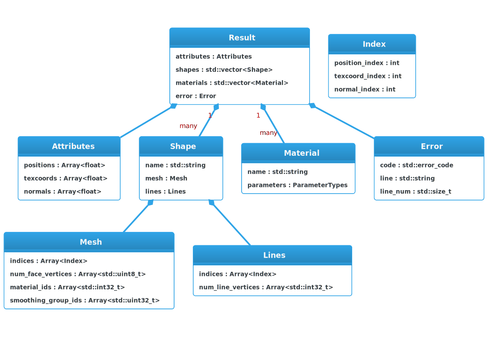
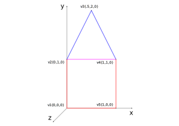
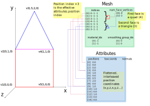

# RapidObj

[](https://en.wikipedia.org/wiki/C%2B%2B17)
[](https://opensource.org/licenses/MIT)


- [About](#about)
- [Integration](#integration)
  - [Prerequisites](#prerequisites)
  - [Manual Integration](#manual-integration)
  - [CMake Integration](#cmake-integration)
- [API](#api)
- [RapidObj Result](#rapidobj-result)
- [Next Steps](#next-steps)
- [OS Support](#os-support)
- [Third Party Tools and Resources](#third-party-tools-and-resources)
- [License](#license)

## About

RapidObj is an easy-to-use, single-header C++17 library that loads and parses [Wavefront .obj files](https://en.wikipedia.org/wiki/Wavefront_.obj_file).

The .obj file format was first used by Wavefront Technologies around 1990. However, this 3D geometry file format did not age well. An .obj file is a text file and, consequently, large models take a lot of of disk space and are slow to load and parse. Moreover, after loading and parsing, additional processing steps are required to transform the data into a format suitable for hardware (i.e. GPU) rendering. Nevertheless, .obj files are common enough in the wild that it's useful to have an efficient way to parse them.

RapidObj's API was influenced by another single header C++ library, [tinyobjloader](https://github.com/tinyobjloader/tinyobjloader). From users' point of view, the two libraries look fairly similar. That said, tinyobjloader has been around for some time; it is a mature and well tested library. So, why use RapidObj library? It is fast, and especially so when parsing large files. It was designed to take full advantage of modern computer hardware. See [Benchmarks](docs/BENCHMARKS.md) page.

## Integration

### Prerequisites

You will need a C++ compiler that fully supports C++17 standard. In practice, this means:

- GCC 8 or higher
- MSVC 19.14 or higher
- Clang 7 or higher

If you intend to use CMake as your build system, you will need to install CMake version 3.20 or higher.

If building on Linux, make sure to first install _libaio_ library and its header files. On Debian:

```bash
sudo apt install libaio-dev
```

On RHEL or Fedora:

```bash
sudo yum install libaio-devel
```

### Manual Integration

The simplest way to integrate the library in your project is to copy the header file, ```rapidobj.hpp```, to a location that is in your compiler's include path. To use the library from your application, include the header file:

```cpp
#include "rapidobj.hpp"
```

To compile your project, make sure to use the C++17 switch (```-std=c++17``` for g++ and clang, ```/std:c++17``` for MSVC).

There are some extra considerations when building a Linux project: you need to link your application against _libpthread_ and _libaio_ libraries. For example, assuming g++ compiler:

```bash
g++ -std=c++17 my_src.cpp -pthread -laio -o my_app
```

> :page_facing_up: If you are using gcc version 8, you also have to link against the _stdc++fs_ library (_std::filesystem_ used by RapidObj is not part of _libstdc++_ until gcc version 9).

### CMake Integration

#### External

This section explains how to use RapidObj external to your project. If using the command line, perform cmake configuration and generation steps from inside the RapidObj folder:

```bash
cmake -B build .
```

The next step is to actually install the RapidObj package:

```bash
cd build
sudo make install
```

The install command will copy the files to well defined system directories. Note that this command will likely require administrative access.

The only remaining step is to find the RapidObj package from inside your own CMakeLists.txt file and link against it. For example:

```cmake
add_executable(my_app my_src.cpp)

find_package(RapidObj REQUIRED)

target_link_libraries(my_app PRIVATE rapidobj::rapidobj)
```

RapidObj cmake script places the header file in a ```rapidobj``` subfolder of the include directory. Consequently, the include directive in your code should look like this:

```cpp
#include "rapidobj/rapidobj.hpp"
```

What if you don't want to install RapidObj in a system directory? RapidObj allows you to specify custom install folders. CMake cache variable RAPIDOBJ_INCLUDE_DIR is used to set header file install location; RAPIDOBJ_CMAKE_DIR is used to set cmake files install location. For example, to install RapidObj in a folder ```local``` inside your home directory, the cmake configuration and generation steps are as follows:

```bash
cmake -B build -DRAPIDOBJ_INCLUDE_DIR=${HOME}/local/include -DRAPIDOBJ_CMAKE_DIR=${HOME}/local/cmake .
```

The install step is almost the same as before:

```bash
cd build
make install
```

The only difference is that administrative access (i.e. sudo) is no longer required since the destination is users' home folder, as opposed to system folders.

Because the files have been installed to a custom location that CMake does not know about, CMake cannot find the RapidObj package automatically. We can fix this by providing a hint about the cmake directory whereabouts:

```cmake
add_executable(my_app my_src.cpp)

find_package(RapidObj REQUIRED HINTS $ENV{HOME}/local/cmake)

target_link_libraries(my_app PRIVATE rapidobj::rapidobj)
```

Once the package has been successfully installed, RapidObj directory can be deleted.

#### Embedded

Another way to use RapidObj is to embed it inside your project. In your project's root, create a folder named thirdparty and then copy RapidObj to this folder. Installation is not required; it is sufficient to add RapidObj's subfolder to your project:

```cmake
add_executable(my_app my_src.cpp)

add_subdirectory(thirdparty/rapidobj)

target_link_libraries(my_app PRIVATE rapidobj::rapidobj)
```

If you do not wish to manually download and place RapidObj files, you can automate these steps by using CMake's FetchContent module:

```cmake
add_executable(my_app my_src.cpp)

include(FetchContent)

FetchContent_Declare(rapidobj
    GIT_REPOSITORY  https://github.com/guybrush77/rapidobj.git
    GIT_TAG         origin/master)

FetchContent_MakeAvailable(rapidobj)

target_link_libraries(my_app PRIVATE rapidobj::rapidobj)
```

## API

The API of the RapidObj library is rather simple. It consists of two free-standing functions: ```ParseFile()``` and ```Triangulate()```.

Function ```ParseFile()``` loads an .obj file, parses it and returns a result object. The result object contains vertex attribute arrays, shapes and materials. A shape object contains a collection of polygons (i.e. a mesh) or a collection of polylines.

Each polygon in a mesh may have 3 sides (triangle), 4 sides (quadrilateral), 5 sides (pentagon) - all the way up to the 255 sides maximum. Function ```Triangulate()``` takes a result object, loops through all the meshes, and decomposes polygons with more than three sides into a set of triangles. However, if the meshes are already triangulated, then the function call will do nothing.

Suppose we want to find out the total number of triangles in an .obj file. This can be accomplished by passing the .obj file path to```ParseFile()``` and triangulating the result. The next step is looping through all the meshes; in each iteration, the number of triangles in the current mesh is added to the running sum. The code for this logic is shown below:

```cpp
#include "rapidobj/rapidobj.hpp"

#include <iostream>

int main()
{
    auto result = rapidobj::ParseFile("/path/to/my.obj");

    if (result.error) {
        std::cout << result.error.code.message() << '\n';
        return EXIT_FAILURE;
    }

    bool success = rapidobj::Triangulate(result);

    if (!success) {
        std::cout << result.error.code.message() << '\n';
        return EXIT_FAILURE;
    }

    auto num_triangles = size_t();

    for (const auto& shape : result.shapes) {
        num_triangles += shape.mesh.num_face_vertices.size();
    }

    std::cout << "Shapes:    " << result.shapes.size() << '\n';
    std::cout << "Materials: " << result.materials.size() << '\n';
    std::cout << "Triangles: " << num_triangles << '\n';

    return EXIT_SUCCESS;
}
```

## RapidObj Result

Let's take a closer look at the ```Result``` object returned by the ```ParseFile()``` function. Its structure corresponds closely to the format of an .obj file.

3D objects are usually represented as a set of faces and a set of vertices. A vertex has attributes, the most important of which is its position. The positions are stored as Cartesian coordinates in the ```result.attributes.positions array```. An .obj file also supports two more vertex attributes: texture coordinates (used for UV mapping) and normals. These are stored in ```result.attributes.texcoords``` and ```result.attributes.normals``` arrays.

A vertex is generated by indexing into the attributes array(s). An object of type ```Index``` defines a single vertex. It has three fields: ```position_index```, ```texcoord_index```, and ```normal_index```. Only the ```position_index``` is mandatory; a vertex might not have any normals or UV coordinates. In this case, -1 (invalid index) is stored in ```index.normal_index``` and ```index.texcoord_index```.

```Index``` objects (i.e. vertices) are stored in the ```shape.mesh.indices``` array. Because the indices array is flattened, extra information is required to distinguish individual faces. The number of vertices per face is kept in the ```shape.mesh.num_face_vertices``` array. The size of this array is equal to the number of faces in the mesh. Note that, for triangulated meshes, this complexity goes away; every entry in the ```shape.mesh.num_face_vertices``` array is 3. It is safe to assume that entries { 0, 1, 2 } of the ```shape.mesh.indices``` array form triangle face 0, entries { 3, 4, 5 } form triangle face 1, entries { 6, 7, 8 } form triangle face 2, etc.

The mesh object also contains (per face) material IDs and smoothing group IDs. These are stored in ```shape.mesh.material_ids``` and ```shape.mesh.smoothing_group_ids```. Material IDs index into the ```result.materials``` array. Smoothing group IDs are used to calculate vertex normals in case they are not provided.

Meshes are not stored directly in the result object. Instead, a ```Shape``` object contains either a mesh, polylines (```Lines```), or both. The result object can contain one or more shapes.

Let's consider a concrete example:

The mesh in this simple shape consists of five vertices. Moving clockwise, starting from the origin, the vertices are: v1, v2, v3, v4, and v5.

There are two faces in this mesh: a quad and a triangle. Moving clockwise, starting from the origin, the vertex indices of the quad are: 1, 2, 4, and 5. The vertex indices for the triangle are: 2, 3, and 4.

An .obj file for this shape would then look like:

```markdown
v  0  0  0
v  0  1  0
v .5  2  0
v  1  1  0
v  1  0  0

f  1  2  4  5
f  2  3  4
```

Running the ```ParseFile``` on this .obj file would produce the following:



There are a few things to note:

- Vertex coordinates x, y, z are interleaved in the attributes ```positions``` array (i.e. v1<sub>x</sub>, v1<sub>y</sub>, v1<sub>z</sub>, v2<sub>x</sub>, v2<sub>y</sub>, v2<sub>z</sub>, ... , v5<sub>x</sub>, v5<sub>y</sub>, v5<sub>z</sub>).
- Since we are not using texture coordinates or normals in this example, attribute ```texcoords``` and ```normals``` arrays are empty; likewise, all the mesh texcoords and normals indices are set to -1 in the mesh ```indices``` array.
- All the position indices in the mesh ```indices``` array are decremented by 1 compared to the .obj file face indices (because C/C++ arrays are zero-based).
- To index into the attribute positions array, it is necessary to multiply the mesh ```indices``` position index by 3 and then add an offset. For example, assuming position index ```n```, the effective indices for vertex position coordinates (x, y, z) are: ```(3n + 0, 3n + 1, 3n + 2)```.
- The material IDs for both faces are set to -1 in the mesh ```material_ids``` array. Value of -1 means that no material is assigned to the face.
- The smoothing group IDs for both faces are set to 0 in the mesh ```smoothing_group_ids``` array. Value of 0 indicates that the face does not belong to any smoothing group.

## Next Steps

Typically, parsed .obj data cannot be used "as is". For instance, for hardware rendering, a number of additional processing steps are required so that the data is in a format easily consumed by a GPU. RapidObj provides one convenience function, ```Triangulate()```, to assist with this task. Other tasks must be implemented by the rendering application. These may include:

- Gathering all the attributes so that the vertex data is in a single array of interleaved attributes. This step may optionally include vertex deduplication.
- Generate normals in case they are not provided in the .obj file. This step may use smoothing groups (if any) to create higher quality normals.
- Optionally optimise the meshes for rendering based on some criteria such as: material type, mesh size, number of batches to be submitted, etc.

## OS Support

- Windows
- macOS
- Linux

## Third Party Tools and Resources

This is a list of third party tools and resources used by this project:

- [3D models](https://casual-effects.com/data/) from McGuire Computer Graphics Archive
- [cereal](https://uscilab.github.io/cereal/) for serialization
- [CMake](https://cmake.org/) for build automation
- [cxxopts](https://github.com/jarro2783/cxxopts) for command line option parsing
- [doctest](https://github.com/onqtam/doctest) for testing
- [earcut.hpp](https://github.com/mapbox/earcut.hpp) for polygon triangulation
- [fast_float](https://github.com/fastfloat/fast_float) for string to float parsing
- [tinyobjloader](https://github.com/tinyobjloader/tinyobjloader) for .obj file parsing
- [xxHash](https://github.com/Cyan4973/xxHash) for hashing

## License

The RapidObj single-header library is licensed under the MIT License.

The RapidObj single-header library contains a copy of [fast_float](https://github.com/fastfloat/fast_float) number parsing library from Daniel Lamire which is licensed under the MIT License as well as under the Apache 2.0 License.

The RapidObj single-header library contains a copy of [earcut.hpp](https://github.com/mapbox/earcut.hpp) polygon triangulation library from Mapbox which is licensed under the ISC License.
