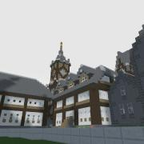
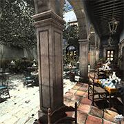

# Benchmarks

The libraries benchmarked are:

- **fast_obj** - https://github.com/thisistherk/fast_obj (master 85778da)
- **rapidobj** - https://github.com/guybrush77/rapidobj (master 7a86567)
- **tinyobjloader** - https://github.com/tinyobjloader/tinyobjloader (release 2f94771)

## Hardware

- CPU: **AMD 7950X**
- Memory: **DDR5 5200**
- SSD: **WD SN8500X NVMe**

## Software

- OS: **Ubuntu 22.04.1 LTS** (*Kernel 5.15.0-56-generic*)
- Compiler: **g++-12** (*-O3 -DNDEBUG*)

## Methodology

- Each test result is the average of ten runs.
- Standard deviation is displayed as a narrow black bar.
- OS page cache is cleared before each run.

## Results

URL: https://casual-effects.com/g3d/data10/research/model/rungholt/rungholt.zip

Shapes: 84

Triangles: 6,704,264

Size on disk: 236,055,639 bytes

 

# 

URL: https://casual-effects.com/g3d/data10/research/model/powerplant/powerplant.zip

Shapes: 21

Triangles: 12,759,246

Size on disk: 817,891,724 bytes

 

# 

URL: https://casual-effects.com/g3d/data10/research/model/San_Miguel/San_Miguel.zip

Shapes: 2203

Triangles: 9,980,699

Size on disk: 1,143,041,382 bytes

 

# 

URL: [Blender 3.zip](https://storage.googleapis.com/5649de716dcaf85da2faee95/_%2Fcd30f78645644eb1a5a27031eea2b7bd.zip?GoogleAccessId=956532172770-27ie9eb8e4u326l89p7b113gcb04cdgd%40developer.gserviceaccount.com&Expires=1678735382&Signature=kKVu7kvq7EhblJyVpna2P9zV7sXOeOuSBL82PWcJLiM9LpSXA9o%2FTEKKTZW8s7c%2FUTcIuldTUSBg%2FtZkPDnL64wqpK%2BDrZY3yigEo5zqWdV4IwIYYO4mu93hRpJZpAOs8XOlfX13%2B9zjnbqTRdGXDpCGOQ%2FK0i3YViOyVdhkKpvUokQeNrNxq%2FcxBCzJ6pG0fRZ56Klk2QIXwD7VBxsEBgbt1cymHL5zHPiLcLtNZ7Unxt7HZ%2F%2Faq3T%2BlL%2BVJ9TTwts68%2F5a%2Fuv9HrglFAY%2B6Gn5CmYoUJsHk%2FSb0YaiC9xPb6VednvfZDE%2BLjojWqRZvT4%2BhjrxqV0%2F8sCoa8En3g%3D%3D) (Export to .obj using Blender)

Shapes: 24,257

Triangles: 28,501,624

Size on disk: 2,564,449,006 bytes

 

# 
